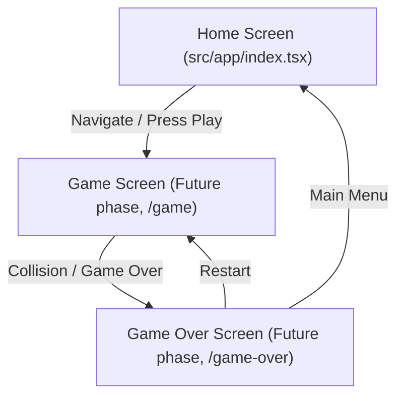

# UI Contracts: Navigation Routes

This contract defines the page routes managed by `expo-router` within the application.

## Directory Layout (`src/app/`)

* `src/app/_layout.tsx`: Root layout component, provides common providers (Safe Area, Theme, store contexts) and establishes stack/tab routing configurations.
* `src/app/index.tsx`: The primary landing page (Home Screen). Matches `/` URL.
* `src/app/explore.tsx`: A temporary exploration screen from the boilerplate, matches `/explore` URL.

## Navigation Transitions

## Route Schema

| Path | Screen Name | Component | Access | Purpose |
|---|---|---|---|---|
| `/` | Home Screen | `index.tsx` | Public | Main Menu showing Game Title, Play Button, and High Score display. |
| `/explore` | Explore Screen | `explore.tsx` | Public | Explanatory/developer exploration (Boilerplate). |
